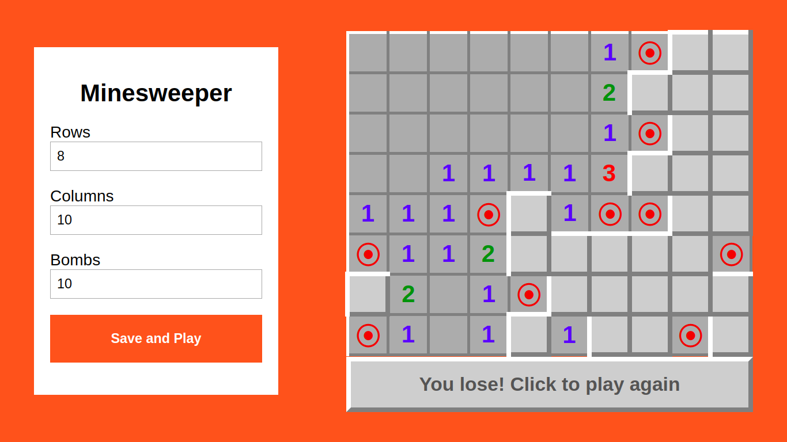

# Minesweeper

Web version of the classic Minesweeper



# Getting Started

- Clone the repositorie with

```bash
git clone https://github.com/GuilhermeBalog/minesweeper.git
```

- Open the `index.html` file on your favorite browser!

Feel free to fork this repo and add your ideias!